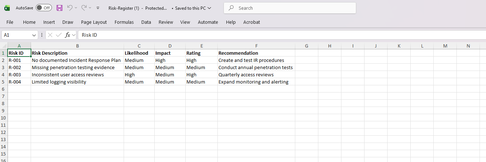

# Third-Party Vendor Risk Assessment Lab

## Overview

This project simulates a third-party vendor risk assessment for a fictional SaaS provider.

## Key Findings

| Risk ID | Finding | Rating |
|----------|----------|----------|
| R-001 | No documented Incident Response Plan | High |
| R-002 | Missing penetration testing evidence | Medium |
| R-003 | Inconsistent user access reviews | High |
| R-004 | Limited logging visibility | Medium |

## Risk Register Preview

## Deliverables

- Assessment Report.docx
- Risk-Register.xlsx

## Skills Demonstrated

- Vendor Risk Management
- Risk Assessment
- Security Documentation
- Governance, Risk & Compliance (GRC)

- ## Risk Register Preview
